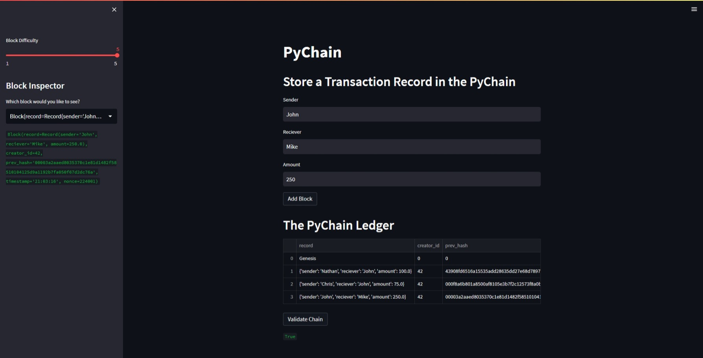

# PyChain

You’re a fintech engineer who’s working at one of the five largest banks in the world. You were recently promoted to act as the lead developer on their decentralized finance team. Your task is to build a blockchain-based ledger system, complete with a user-friendly web interface. This ledger will allow partner banks to conduct financial transactions (that is, to transfer money between senders and receivers) and to verify the integrity of the data in the ledger.

# Application in Service

As shown in the image above the application can add blocks with the necessary variables, validate the chain, altrer the 'Block Difficulty', and inspect the Blocksin the chain.
